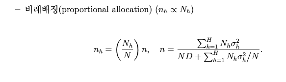

```{r }
data.example <- readRDS("./data.example.rds")
```

```{r}
str(data.example) # Structure of the given data set.
salary.vector <- c(); # 모집단의 연봉 자료
salary.var_h <- c(); # 모집단의 각 층에 대한 연봉자료의 모분산
work.time.per.year_h <- c()# 모집단의 각 층에 대한 연간 근로 시간 총합
N_h <- c() # 각 층의 모집단 갯수

for (i in 1:length(data.example)) {
  salary <- data.example[[i]][,7]
  n <- length(salary)

  N_h <- c(
    N_h, 
    dim(data.example[[i]])[1]
  ) # 각 층의 모집단 갯수 
  salary.vector <- c(
    salary.vector, 
    salary
  )  # 모집단의 연봉 자료 
  salary.var_h <- c(
    salary.var_h, 
    var(salary)*(n-1)/n
  ) # 각 층의 salary true variance
  work.time.per.year_h <- c(
    work.time.per.year_h,
    sum(data.example[[i]][,6])
  ) #각 층의 연간 근로시간의 모총합 : \tau_{xh}
}

N <- sum(N_h) # 모집단의 수
salary.true <- mean(salary.vector) # 연봉의 모평균 
```



```{r}
#proportional allocation

D = 5 # D가 클수록 샘플 갯수는 감소
n_prop = round(
  sum(N_h*salary.var_h)/(N*D+sum(N_h*salary.var_h)/N)
) # prop 배정을 통한 전체 샘플 갯수  
n_h <- round((N_h/N)*n_prop) # 각층의 샘플 갯수 

```

# Comparision : Simple random sampling(srs) , Stratified sampling(st), Stratified Separate ratio (st.Rs) and Stratified Combined ratio (st.Rc)

# We approximate MSE using 1000 iterations

```{r}
salary.est.srs <- c() # Simple random sampling
salary.est.st <- c() # Stratified Sampling
salary.est.st.Rs <- c() # Separate ratio estimator
salary.est.st.Rc <- c() # Combined ratio estimator

for (j in 1:1000) {
  index_list <- list()
  for (k in 1:length(data.example)) {
    index_list[[k]] <- sample(
      1:dim(data.example[[k]])[1], 
      n_h[k], 
      replace=F
    ) # random sample index
  }
  
  salary.sample.st <- c()
  work.time.per.year.sample.st <- c()
  
  for (i in 1:10) {
    salary.sample.st <- c(
      salary.sample.st, 
      mean(data.example[[i]][,7][index_list[[i]]])
    )  # \bar{Y_h} 
    work.time.per.year.sample.st <- c(
      work.time.per.year.sample.st, 
      mean(data.example[[i]][,6][index_list[[i]]])
    )  # \bar{X_h}
  }
  
  # SRS
  salary.sample.srs <- sample(salary.vector, n_prop, replace=F) 
  salary.est.srs[j] <- mean(salary.sample.srs)
  
  #ST
  salary.est.st[j] <- sum(salary.sample.st*N_h/N)
  
  # we assume that 연봉 = beta*연간 근로시간총합 + Error
  
  # ST_RS (Separate)
  b_h <- salary.sample.st/work.time.per.year.sample.st # 각 층마다 추정하는 beta 추정값 
  salary.est.st.Rs[j] <- sum(b_h*work.time.per.year_h/N) # work.time.per.year_h= \tau_{xh} in lecture note
  
  #ST_RC (Combined)
  b_c <- sum(salary.sample.st*N_h/N)/sum(work.time.per.year.sample.st*N_h/N)
  salary.est.st.Rc[j] <- b_c*sum(work.time.per.year_h)/N
}

cat("SRS MSE is: ", mean((salary.est.srs - salary.true )^2), "\n") 
cat("ST allocation MSE is: ", mean((salary.est.st - salary.true )^2), "\n") 
cat("SRS_RS MSE is: ", mean((salary.est.st.Rs - salary.true )^2), "\n") 
cat("SRS_RC MSE is: ", mean((salary.est.st.Rc - salary.true )^2), "\n") 

```

# check the first 20 values with high deviation.

```{r}
cat(
  "First 20 values with high deviation of SRS is: ",
  ((salary.est.st-salary.true)^2)[order((salary.est.st-salary.true)^2, decreasing=T)][1:20],
  "\n\n"
)
cat(
  "First 20 values with high deviation of SRS is: ",
  ((salary.est.srs-salary.true)^2)[order((salary.est.srs-salary.true)^2,decreasing=T)][1:20],
  "\n\n"
)
cat(
  "First 20 values with high deviation of SRS is: ",
  ((salary.est.st.Rs-salary.true)^2)[order((salary.est.st.Rs-salary.true)^2,decreasing=T)][1:20],
  "\n\n"
)
cat(
  "First 20 values with high deviation of SRS is: ",
  ((salary.est.st.Rc-salary.true)^2)[order((salary.est.st.Rc-salary.true)^2,decreasing=T)][1:20]
)
```
