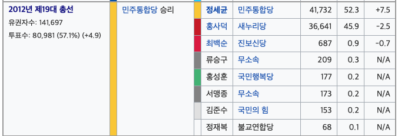

```{r}
pop <- readRDS("population.rds")
str(pop)
```
### 상호관입 계통 표집
##  모형 1 : 임의 모집단 
```{r}
############### Analysis for pop 1 ###############


rep.num = 1000 # repeat number for Average MSE calculations
pop1 <- pop[[1]]
N <- length(pop1)
k = 9
n <- 180
n_prime <- 30
n_s <- 6
k_prime <- n_s*k # 54

mse.pop1 <- c()
for (zz in 1:rep.num) {
  
  initial_index <- sample(1:k_prime, 6)
  
  for (i in 1:6) {
    # `assign` assigns a value to the variable with the name of given string
    assign(paste("index_", i, sep=""), initial_index[i])
  }
  
  for (i in 1:6) {
    assign(
      paste("index_", i, sep=""), 
      c(
        get(paste("index_", i, sep="")),
        # `get` gets the value of the variable with the name of given string
        k_prime*(1:29) + get(paste("index_", i, sep=""))
      )
    )
  }
  
  ybar <- c(
    mean(pop1[index_1]),
    mean(pop1[index_2]),
    mean(pop1[index_3]),
    mean(pop1[index_4]),
    mean(pop1[index_5]),
    mean(pop1[index_6])
  )
  mu_hat <- mean(ybar)
  s_m_sq <- sum((ybar - mu_hat)^2)/(n_s - 1)

  # \widehat{Var}(\hat{\mu}) = (k^prime-n_s)/k^prime* s_m^2/n_s
  estimated.var.mu_hat <- (k_prime - n_s)/k_prime*(s_m_sq/n_s)

  true.sigma_sq <- var(pop1)*(N-1)/N # true sigma_sq
  
  pop1_mat <- matrix(pop1, ncol=9, byrow=T)
  
  # check whether the matrix form is right or not
  pop1_mat[1:2, ]
  pop1[1:18]
  
  y_single_bar <- apply(pop1_mat, 2, mean) # columwise mean i.e. 각 계통 추출 표본 
  
  SSW <- 0
  
  for (i in 1:k) {
    SSW <- SSW + sum((pop1_mat[,i] - y_single_bar[i])^2)
  }
  
  true.var.mu_hat <- true.sigma_sq - SSW/N # equation (5.4) in textbook.
  
  mse.pop1[zz] <- (true.var.mu_hat - estimated.var.mu_hat)^2
}

boxplot(mse.pop1, main="MSE of interpenetrating systematic sampling. Pop.1")

```

## 모형 2 : 층화 효과
```{r}
############### Analysis for pop 2 ###############
pop2 <- pop[[2]]
pop2_mat <- matrix(pop2, ncol=9, byrow=T)

pop2 <- pop[[2]]
N <- length(pop2)
k = 9
n <- 180
n_prime <- 30
n_s <- 6
k_prime <- n_s*k #(=54)


mse.pop2 <- c()
for (zz in 1:rep.num) {
  
  initial_index <- sample(1:k_prime, 6)
 
  for (i in 1:6) {
    assign(paste("index_", i, sep=""), initial_index[i])
  }
  
  # get(paste("area_partition_",i,sep=""))
  for (i in 1:6) {
    assign(
      paste("index_", i, sep=""),
      c(
        get(paste("index_", i, sep="")),
        k_prime*(1:29) + get(paste("index_", i, sep=""))
      )
    )
  }
  
  ybar <- c(
    mean(pop2[index_1]),
    mean(pop2[index_2]),
    mean(pop2[index_3]),
    mean(pop2[index_4]),
    mean(pop2[index_5]),
    mean(pop2[index_6])
  )
  
  mu_hat <- mean(ybar)
  s_m_sq <- sum((ybar-mu_hat)^2)/(n_s-1)
  
  estimated.var.mu_hat <- (k_prime-n_s)/k_prime*(s_m_sq/n_s)
  
  true.sigma_sq <- var(pop2)*(N-1)/N
  
  pop2_mat <- matrix(pop2, ncol=9, byrow=T)
  # check whether the matrix form  is right or not
  pop2_mat[1:2, ]
  pop2[1:18]
  
  y_single_bar <- apply(pop2_mat, 2, mean) # columwise mean
  
  SSW <- 0
  for (i in 1:k) {
    SSW <- SSW + sum((pop2_mat[,i] - y_single_bar[i])^2)
  }
  
  true.var.mu_hat <- true.sigma_sq-SSW/N
  
  mse.pop2[zz] <- (true.var.mu_hat-estimated.var.mu_hat)^2
}

boxplot(mse.pop2, main="MSE of interpenetrating systematic sampling. Pop.2")
```

## 모형 3 선형 추세 
```{r}
############### Analysis for pop 3 ###############

pop3 <- pop[[3]]
N <- length(pop3)

plot(1:N, pop3[1:N]) # There exist linear trend

k = 9
n <- 180
n_prime <- 30
n_s <- 6
k_prime <- n_s*k #(=54)

mse.pop3 <- c()
for (zz in 1:rep.num) {
  initial_index <- sample(1:k_prime, 6)

  
  for (i in 1:6) {
    assign(paste("index_", i, sep=""), initial_index[i])
  }
  
  for (i in 1:6) {
    assign(
      paste("index_", i, sep=""),
      c(
        get(paste("index_", i, sep="")),
        k_prime*(1:29) + get(paste("index_", i, sep=""))
      )
    )
  }
  
  ybar <- c(
    mean(pop3[index_1]),
    mean(pop3[index_2]),
    mean(pop3[index_3]),
    mean(pop3[index_4]),
    mean(pop3[index_5]),
    mean(pop3[index_6])
  )
  mu_hat <- mean(ybar)
  s_m_sq <- sum((ybar-mu_hat)^2)/(n_s-1)
  
  estimated.var.mu_hat <- (k_prime-n_s)/k_prime*(s_m_sq/n_s)
  
  
  true.sigma_sq <- var(pop3)*(N-1)/N
 
  
  pop3_mat <- matrix(pop3, ncol=9, byrow=T)
  # check whether the matrix form  is right or not
  pop3_mat[1:2,]
  pop3[1:18]
  
  y_single_bar <- apply(pop3_mat, 2, mean) # columwise mean
  
  SSW <- 0
  for (i in 1:k) {
    SSW <- SSW + sum((pop3_mat[, i] - y_single_bar[i])^2)
  }
  
  true.var.mu_hat <- true.sigma_sq-SSW/N
  
  mse.pop3[zz] <- (true.var.mu_hat - estimated.var.mu_hat)^2
}

boxplot(mse.pop3,main="MSE of interpenetrating systematic sampling. Pop.3")
```


## vote 1번 : 홍사덕 (새누리당), vote 2번 : 정세균 (민주통합당)
```{r}
############### Real Data Example (vote) ###############
vote <- read.csv("vote.csv", header=T)
num <- length(unique(vote$num))

Area <- list()
for (i in 1:num) {
  Area[[i]] <- vote[vote[, names(vote)=="num"]==i, ]
}

Partition <- c()
for (i in 1:num) {
  Partition[i] <- round(dim(Area[[i]])[1]/10)
}


for (i in 1:num) {
  assign(paste("area_partition_", i, sep=""), list())
}

area_partition_1

```


## 각 투표소를 시간 10등분으로 나누어서 투표율을 조사 (EDA)
```{r}
for (i in 1:9) {
  area_partition_1[[i]]<-Area[[1]][(1+Partition[1]*(i-1)):(Partition[1]*i),]
  area_partition_2[[i]]<-Area[[2]][(1+Partition[2]*(i-1)):(Partition[2]*i),]
  area_partition_3[[i]]<-Area[[3]][(1+Partition[3]*(i-1)):(Partition[3]*i),]
  area_partition_4[[i]]<-Area[[4]][(1+Partition[4]*(i-1)):(Partition[4]*i),]
  area_partition_5[[i]]<-Area[[5]][(1+Partition[5]*(i-1)):(Partition[5]*i),]
  area_partition_6[[i]]<-Area[[6]][(1+Partition[6]*(i-1)):(Partition[6]*i),]
  area_partition_7[[i]]<-Area[[7]][(1+Partition[7]*(i-1)):(Partition[7]*i),]
  area_partition_8[[i]]<-Area[[8]][(1+Partition[8]*(i-1)):(Partition[8]*i),]
  area_partition_9[[i]]<-Area[[9]][(1+Partition[9]*(i-1)):(Partition[9]*i),]
  area_partition_10[[i]]<-Area[[10]][(1+Partition[10]*(i-1)):(Partition[10]*i),]
  area_partition_11[[i]]<-Area[[11]][(1+Partition[11]*(i-1)):(Partition[11]*i),]
  area_partition_12[[i]]<-Area[[12]][(1+Partition[12]*(i-1)):(Partition[12]*i),]
  area_partition_13[[i]]<-Area[[13]][(1+Partition[13]*(i-1)):(Partition[13]*i),]
  if (i == 9) {
    area_partition_1[[(i+1)]]<-Area[[1]][(1+Partition[1]*(i)):dim(Area[[1]])[1],]
    area_partition_2[[(i+1)]]<-Area[[2]][(1+Partition[2]*(i)):dim(Area[[2]])[1],]
    area_partition_3[[(i+1)]]<-Area[[3]][(1+Partition[3]*(i)):dim(Area[[3]])[1],]
    area_partition_4[[(i+1)]]<-Area[[4]][(1+Partition[4]*(i)):dim(Area[[4]])[1],]
    area_partition_5[[(i+1)]]<-Area[[5]][(1+Partition[5]*(i)):dim(Area[[5]])[1],]
    area_partition_6[[(i+1)]]<-Area[[6]][(1+Partition[6]*(i)):dim(Area[[6]])[1],]
    area_partition_7[[(i+1)]]<-Area[[7]][(1+Partition[7]*(i)):dim(Area[[7]])[1],]
    area_partition_8[[(i+1)]]<-Area[[8]][(1+Partition[8]*(i)):dim(Area[[8]])[1],]
    area_partition_9[[(i+1)]]<-Area[[9]][(1+Partition[9]*(i)):dim(Area[[9]])[1],]
    area_partition_10[[(i+1)]]<-Area[[10]][(1+Partition[10]*(i)):dim(Area[[10]])[1],]
    area_partition_11[[(i+1)]]<-Area[[11]][(1+Partition[11]*(i)):dim(Area[[11]])[1],]
    area_partition_12[[(i+1)]]<-Area[[12]][(1+Partition[12]*(i)):dim(Area[[12]])[1],]
    area_partition_13[[(i+1)]]<-Area[[13]][(1+Partition[13]*(i)):dim(Area[[13]])[1],]
  }
}

Area_conservative <- list()
Area_Liberal <- list()

for (k in 1:num) {
  conv <- c()
  lib <- c()
  for(i in 1:10) {
    conv[i] <- mean(get(paste("area_partition_", k, sep=""))[[i]]$vote1==1)
    lib[i] <- mean(get(paste("area_partition_", k, sep=""))[[i]]$vote1==2)
  }
  
  Area_conservative[[k]] <- conv
  Area_Liberal[[k]] <- lib
}

par(mfrow=c(2,1))
for (k in 1:num ) {
  plot(
    1:10, 
    Area_conservative[[k]],
    ylim=c(0.2, 0.6),
    main=paste("Conservative (vote = 1) rate for area", k, sep="")
  )  
  plot(
    1:10, 
    Area_Liberal[[k]],
    ylim=c(0.2,0.6),
    main=paste("Liberal (vote = 2) rate for area ", k, sep="")
  )
}
```

$\widehat{V}ar(\widehat{p_2}-\widehat{p_1})\approx \frac{N-n}{N}\frac{\widehat{p_1}(1-\widehat{p_1})}{n-1}+\frac{N-n}{N}\frac{\widehat{p_1}(1-\widehat{p_1})}{n-1}+2\frac{\widehat{p_1}\widehat{p_2}}{n}$

```{r}
dim(vote)

N <- 80981 # 종로구 투표 인원
n <- dim(vote)[1] # 표본 수 
total.conservative <- dim(vote[vote$vote1==1, ])[1]/n
total.liberal <- dim(vote[vote$vote1==2, ])[1]/n

diff_12 <- total.conservative-total.liberal
# Assume 1. 계통추출 된것을 단순 임의 비복원 추출이라고 가정
# Assume 2. cov(hat(p_1),hat(p_2)) 계산하기 위하여 복원 추출로 가정하여 계산

estimated.var.diff_12 <- (N-n)/N*total.conservative*(1-total.conservative)/(n-1)+(N-n)/N*total.liberal*(1-total.liberal)/(n-1)+2*total.conservative*total.liberal/n
```

#Confidence interval for $p_1-p_2$
```{r}
c(diff_12-sqrt(estimated.var.diff_12),diff_12+sqrt(estimated.var.diff_12))
```


```


