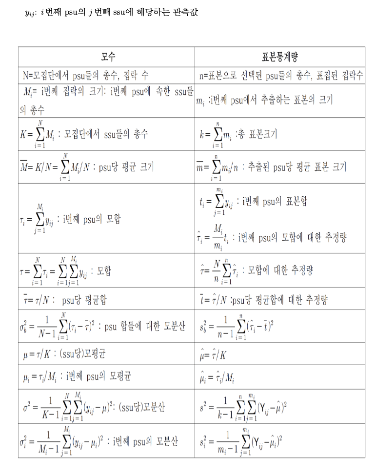

### Simulation data generate

$Y_{ij}^h=\mu^h+\alpha_i+\epsilon_{ij}, \quad \alpha_i\sim N(0,\sigma_\alpha^2)\quad \epsilon_{ij}\sim N(0,\sigma_\sigma^2)$,\quad

$ICC=\frac{\sigma_\alpha^2}{\sigma_\alpha^2+\sigma_\epsilon^2}$

각 집락간 편차가 작을수록, 집락내 편차가 클수록 우리는 집락 추출법이 효율적이라는 사실을 배웠으므로 아래의 data set k=1~3으로 갈 수록 데이터 생성을 집락간 편차가 작게 생성하였다. 그 결과 우리는 data set$k=3$에서 집락 추출법을 적용하면 추정량의 분산이 제일 작아질것으로 기대할 수 있다.

```{r}


set.seed(1015)
# Data generation #
rm(list=ls())
Area<-c("Seoul","Pusan","Daegu"
        ,"Incheon","Kwangju","Daejun"
        ,"Ulsan","Seojong","Kyunggi"
        ,"Kangwon","Chungbook","Choongnam"
        ,"Junbook","Junnam","Kyungbook"
        ,"Kyungnam","Jeju")
Korean_Medicine_Clinic_N<-c(3500,1100,850,600,300,500,290,300,2800,340,380,490,490,350,610,760,160)
Oriental_Hospital_N<-c(42,12,8,15,85,8,7,7,42,8,8,8,26,22,6,7,6)
Korean_Medicine_Clinic_Patient_N<-round(c(287.6365,94.8698,77.9112,68.3255,33.3979,49.7963,30.1925,57.6185,291.7796,40.7990,47.0126,58.8829,52.5524,46.3758,75.4137,85.6772,16.7716),2)*10^4
Oriental_Hospital_Patient_N<-round(c(16.501,7.860,5.823,6.299,70.764,16.530,20.361,20.011,11.726,35.238,10.461,15.199,58.298,52.598,12.507,6.023,4.787),2)*10^3

data_example<-cbind(Korean_Medicine_Clinic_N,Oriental_Hospital_N,Korean_Medicine_Clinic_Patient_N,Oriental_Hospital_Patient_N)

rownames(data_example)<-Area
data_example
N<-dim(data_example)[1]*2
vector_merge_alternatively_func <- function(x, y, n){
  c(x, y)[order(c(ceiling(seq_along(x) / n), seq_along(y)))]}

Korean_Oriental_N<-vector_merge_alternatively_func(data_example[,1],data_example[,2],1) 
Korean_Oriental_Patient_N<-vector_merge_alternatively_func(data_example[,3],data_example[,4],1) # 전체 총 방문 환자 수 
#install.packages("Surrogate")
library(Surrogate)

# M : M_list[[1]][1],  집락1 ( 서울 and 한의원1번 )의 의료기관에 해당기간 총 방문 환자수 : 집락 1 의 크기 
M_list<-list()
for( i in 1 : length(Korean_Oriental_N)){
  M_list[[i]]<-round(RandVec(a=100, b=10^4, s=Korean_Oriental_Patient_N[i], n=Korean_Oriental_N[i], m=1)$RandVecOutput)
}


ICC<-c(0.7,0.3,0)
sigma_epsilon_sq<-1
sigma_alpha_sq_0.7<-ICC[1]/(1-ICC[1])*sigma_epsilon_sq 
sigma_alpha_sq_0.3<-ICC[2]/(1-ICC[2])*sigma_epsilon_sq 
sigma_alpha_sq_0.0<-ICC[3]/(1-ICC[3])*sigma_epsilon_sq 
mu_h_seq<-c(15,20,14,12,8,10,10,10,8,8,10,11,10,12,11,10,7,8,7,7,8,8,6,6,6,7,8,8,7,8,6,8,10,10)


for( i in 1 : 34){
  assign(paste("Y1_",i,sep=""),list())
  assign(paste("Y2_",i,sep=""),list())
  assign(paste("Y3_",i,sep=""),list())
}
# DATA 1
# For example Yk_h[[i]] :  k=1,2,3,에 따라 각기 다른 data,  h ( 1,...,34) 층에서 i 번째 PSU에 방문한 환자들의 비용
# k=1, h=1,...,34 층, i=1,...,N_h 병원 의 편차가 큼
for( h in 1 : 34){
  Y<-get(paste("Y1_",h,sep="")) # Y1_h call
  for( j in 1 : Korean_Oriental_N[h]){ # j는 집락 index 
alpha_vector_0.7<-rnorm(Korean_Oriental_N[h],mean=0,sd=sqrt(sigma_alpha_sq_0.7))# N(0,2.3) 에서 추출, alpha_vector_0.7 편차가 크다.
    Y[[j]]<- round(mu_h_seq[h]+alpha_vector_0.7[j]+rnorm(M_list[[h]][j],0,sqrt(sigma_epsilon_sq)),2)
  }
  assign(paste("Y1_",h,sep=""),Y)
}


# DATA 2
# For example Yk_h[[i]] :  k=1,2,3,에 따라 각기 다른 data,  h ( 1,...,34) 층에서 i 번째 PSU에 방문한 환자들의 비용
# k=2, h=1,...,34 층, i=1,...,N_h 병원 의 편차가 중간 
for( h in 1 : 34){
  Y<-get(paste("Y2_",h,sep="")) # Y1_h call
  for( j in 1 : Korean_Oriental_N[h]){
    alpha_vector_0.3<-rnorm(Korean_Oriental_N[h],mean=0,sd=sqrt(sigma_alpha_sq_0.3))# N(0,0.43) 에서 추출, alpha_vector_0.3 편차가 중간.
    Y[[j]]<- round(mu_h_seq[h]+alpha_vector_0.3[j]+rnorm(M_list[[h]][j],0,sqrt(sigma_epsilon_sq)),2)
  }
  assign(paste("Y2_",h,sep=""),Y)
}


# DATA 3
# For example Yk_h[[i]] :  k=1,2,3,에 따라 각기 다른 data,  h ( 1,...,34) 층에서 i 번째 PSU에 방문한 환자들의 비용
# k=3, h=1,...,34 층, i=1,...,N_h 병원 의 편차가 없음 

for( h in 1 : 34){
  Y<-get(paste("Y3_",h,sep="")) # Y1_h call
  for( j in 1 : Korean_Oriental_N[h]){
    alpha_vector_0.0<-rnorm(Korean_Oriental_N[h],mean=0,sd=sqrt(sigma_alpha_sq_0.0))# N(0,0) 에서 추출, alpha_vector_0.0 편차가 없다.
    Y[[j]]<- round(mu_h_seq[h]+alpha_vector_0.0[j]+rnorm(M_list[[h]][j],0,sqrt(sigma_epsilon_sq)),2)
  }
  assign(paste("Y3_",h,sep=""),Y)
}

```
## 층화 일단 집락 추출 

```{r}
par(mfrow=c(1,3))


############################################################################################################
######################################## 층화 1단 집락 추출 ################################################
############################################################################################################


first.est.var.tau.hat<-c() # variance comparison for data set K=1,2,3
############################################################################################################
############################################################################################################
############################################################################################################
########################################          K=1            ###########################################
############################################################################################################
############################################################################################################
############################################################################################################

set.seed(1015)
# Data generation


#### data handling...


data_example
H<-dim(data_example)[1]*2 # 층의 갯수
# Vector componentwise alternatively merge function
vector_merge_alternatively_func <- function(x, y, n){
  c(x, y)[order(c(ceiling(seq_along(x) / n), seq_along(y)))]}

#Korean_Oriental_N[h] : h 층의 PSU 갯수 (N_h) 
# 
Korean_Oriental_N<-vector_merge_alternatively_func(data_example[,1],data_example[,2],1) 
Korean_Oriental_Patient_N<-vector_merge_alternatively_func(data_example[,3],data_example[,4],1) # 각 층 별 전체 총 방문 환자 수 
# as.vector(M_list[[1]]) #:as.vector(M_list[[h]])[i] : h 층의 PSU[i] 의 크기 
```

# 데이터 생성을 참고하면 M_list는 $h=1\sim 34$층에서 각 집락에 속한 방문 환자 수의 정보를 담고 있다.
# FYI, 1 층의 집락들의 수는 3500개 이다, 2 층의 집락 수는 42개 이다.

```{r}
#for example
M_list[[1]][1]# h=1 층 (서울 - 한의원 ) 의 PSU[1] 의 총 방문자 수  ( 1번째 PSU의 크기)
M_list[[1]][3500]# h=1 층 (서울 - 한의원 ) 의  PSU[3500] 의 총 방문자 수 (3500번째 PSU의 크기 ) 

M_list[[2]][1]# h=2 층 (서울 - 한방병원 ) 의 PSU[1] 의 총 방문자 수  ( 1번째 PSU의 크기)
M_list[[2]][42]# h=2 층 (서울 - 한방병원 ) 의 PSU[42] 의 총 방문자 수  ( 1번째 PSU의 크기)

M_list[[34]][2] # h=34 층 (제주 - 한방병원) 의  PSU[2] 의 총 방문자 수 (2번째 PSU의 크기)


# k=1,2,3은 독립적인 데이터 셋임! 
# Yk_h[[i]] : K 데이터 셋의 h 번째 층의  i 번째 PSU (한의원 혹은 한방병원)의 방문한 환자들의 치료 지불값 벡터 
# Y1_1[[1]] : 1 번째 데이터 셋의 첫번째 PSU에 방문한 환자들의 치료 지불 벡터 
length(Y1_3[[5]]) # 1번째 데이터 셋의 3번째 층의 5번째 psu의 크기
length(Y1_3) # 1번째 데이터 셋의 3번째 층의 PSU의 갯수

```



```{r}
#### PSU 수준의 모수 
# N_h: h 층의 모집단에서 PSU의 총 수
for( h in 1 : 34){
  assign(paste("N_",h,sep=""),as.numeric(Korean_Oriental_N)[h]  )
}
N_1


for( h in 1 : 34){
  assign(paste("M_",h,sep=""),as.vector(M_list[[h]]))
}

#M_h<- h 층의 PSU들의 크기, M_2[1]: 2번째 층의 1번째 PSU의 크기
M_2[1]

for( h in 1 : 34){
  assign(paste("K_",h,sep=""),sum(get(paste("M_",h,sep=""))) )
}
#K_h<- h 층의 모집단에서 SSU의 총 수, K_1 : h=1 층의 PSU각각에 속한 SSU의 총 합 
K_1

# M_bar_h <- h 층의 PSU당 평균 크기
for( h in 1 : 34){
  assign(paste("M_bar_",h,sep=""),get(paste("K_",h,sep=""))/get(paste("N_",h,sep="")) )
}

#tau_vector_h : h 층의 각 PSU 모합 벡터(1*N_h)
for( h in 1 : 34){
  temp_vec<-c()
  Y<-get(paste("Y1_",h,sep="")) # Y1_h call
  for( i in 1 :length( Y) ){
    temp_vec<-c(temp_vec,sum(Y1_1[[i]]))
  }
  assign(paste("tau_vector_",h,sep=""),temp_vec )
}
length(tau_vector_34)

#tau_h : h 층의 모합 
for( h in 1 : 34){
  assign(paste("tau_",h,sep=""),sum(get(paste("tau_vector_",h,sep=""))))
}

#tau_bar_h : h 층의 PSU당 평균 합 
for( h in 1 : 34){
  assign(paste("tau_bar_",h,sep=""),get(paste("tau_",h,sep=""))/get(paste("N_",h,sep="")))
}

#sigma_b_sq_h : h 층의 PSU 합들에 대한 모분산 
for( h in 1 : 34){
  assign(paste("sigma_b_sq_",h,sep="")
         ,1/(get(paste("N_",h,sep=""))-1)*sum( (get(paste("tau_vector_",h,sep=""))-get(paste("tau_bar_",h,sep=""))  )^2   ))
}

# mu_h : h 층의  전체 모평균 
for( h in 1 : 34){
  assign(paste("mu_",h,sep=""),get(paste("tau_",h,sep=""))/get(paste("K_",h,sep="")) )
}
```


```{r}
######################### sampling #########################
######################### sampling #########################  
######################### sampling #########################
######################### sampling #########################
######################### sampling #########################
set.seed(1015)
var_est_tau_hat_vec<-c()
tau_hat_vec<-c()
for(B in 1 : 200){
  #PSU sampling
  #psu_sample_index_h : h 층에서 psu sample index
  for( h in 1 : 34){
    sample_index<-sample(1:get(paste("N_",h,sep="")) , round(get(paste("N_",h,sep="") )*0.01+2) )
    assign(paste("psu_sample_index_",h,sep="")
           ,sample_index[order(sample_index)] )
  }
  
  # 층화 일단 집락 추출 
  #n_h : h 층에서 표본으로 선택된 PSU 총 수
  for( h in 1 : 34){
    assign(paste("n_",h,sep="")
           , length(get(paste("psu_sample_index_",h,sep=""))))
  }
  # m_vector_h : h 층에서 각 PSU 에서 추출되는 표본의 크기 
  # 일단집락에서는 전수 조사이므로  m은 M과 같다.
  for( h in 1 : 34){
    sample_index<-get(paste("psu_sample_index_",h,sep=""))
    M<-get(paste("M_",h,sep=""))
    assign(paste("m_vector_",h,sep=""),M[sample_index])
  }
  #m_bar_h : h 층에서 추출된 PSU당 평균 표본 크기
  for( h in 1 : 34){
    assign(paste("m_bar_",h,sep="")
           , mean(get(paste("m_vector_",h,sep=""))))
  }
  
  #t_vector_h : h 층의 (t1,t2,...,t_nh)
  for( h in 1 : 34){
    sample<-get(paste("psu_sample_index_",h,sep=""))
    Y<-get(paste("Y1_",h,sep="")) # Y1_h call
    temp_vec<-c()
    for( z in sample){
      temp_vec<-c(temp_vec,sum(Y[[z]]))
    }
    
    assign(paste("t_vector_",h,sep=""),temp_vec )
  }
  
  #y_bar_vector_h
  for( h in 1 : 34){
    assign(paste("y_bar_vector_",h,sep="")
           , get(paste("t_vector_",h,sep=""))/get(paste("m_vector_",h,sep="")))
  }
  
  #tau_hat_vector_h
  for( h in 1 : 34){
    M<-get(paste("M_",h,sep=""))
    m<-get(paste("m_vector_",h,sep=""))
    sample_index<-get(paste("psu_sample_index_",h,sep=""))
    assign(paste("tau_hat_vector_",h,sep="")
           , M[sample_index]/m*get(paste("t_vector_",h,sep="")))
  }
  
  #tau_hat_h
  for( h in 1 : 34){
    N<-get(paste("N_",h,sep=""))
    n<-get(paste("n_",h,sep=""))
    assign(paste("tau_hat_",h,sep="")
           , N/n*sum(get(paste("tau_hat_vector_",h,sep=""))))
  }
  
  # t_bar_h
  for( h in 1 : 34){
    assign(paste("t_bar_",h,sep="")
           , get(paste("tau_hat_",h,sep=""))/get(paste("N_",h,sep="")))
  }
  
  # sb_sq_h
  for( h in 1 : 34){
    n<-get(paste("n_",h,sep=""))
    tau_hat_vector<-get(paste("tau_hat_vector_",h,sep=""))
    t_bar<-get(paste("t_bar_",h,sep=""))
    assign(paste("sb_sq_",h,sep="")
           , 1/(n-1)*sum( (tau_hat_vector-t_bar)^2   ))
  }
  
  
  
  # tau_hat
  tau_hat<-0
  for( h in 1 : 34){
    tau_hat_temp<-get(paste("tau_hat_",h,sep=""))
    tau_hat<-tau_hat+tau_hat_temp
  }
  tau_hat_vec[B]<-tau_hat
  #s_sq_h
  s_sq_vector<-c()
  for(h in 1 : 34){
    n<-get(paste("n_",h,sep=""))
    sample_index<-get(paste("psu_sample_index_",h,sep=""))
    tau_vector<-get(paste("tau_vector_",h,sep=""))
    s_sq_vector[h]<-1/(n-1)*sum( (tau_vector[sample_index]-mean(tau_vector[sample_index]))^2  )
  }
  tau_vector
  var_est_tau_hat<-0
  for(h in 1 : 34){
    N<-get(paste("N_",h,sep=""))
    n<-get(paste("n_",h,sep=""))
    s_sq<-s_sq_vector[h]
    
    var_est_tau_hat<-var_est_tau_hat+N^2*(N-n)/N*s_sq/n
  }
  var_est_tau_hat_vec[B]<-var_est_tau_hat # 수식으로 얻은 tau의 추정량에 대한 분산의 추정량 
  
}

boxplot(var_est_tau_hat_vec
        , main="1st & Data set: 1",ylim=c(0.5*10^(14),2.5*10^(14)))
stripchart(var(tau_hat_vec), vertical = T, method = "jitter", add=T, pch=20, col="red",cex=3)


first.est.var.tau.hat[1]<-var(tau_hat_vec) # var(tau_hat_vec) 는 bootstrap 으로 추정한 추정량의 분산 추정량 


############################################################################################################
############################################################################################################
############################################################################################################
########################################          K=2            ###########################################
############################################################################################################
############################################################################################################
############################################################################################################

#### data handling...


data_example
H<-dim(data_example)[1]*2 # 층의 갯수
# Vector componentwise alternatively merge function
vector_merge_alternatively_func <- function(x, y, n){
  c(x, y)[order(c(ceiling(seq_along(x) / n), seq_along(y)))]}

#Korean_Oriental_N[h] : h 층의 PSU 갯수 (N_h) 
# 
Korean_Oriental_N<-vector_merge_alternatively_func(data_example[,1],data_example[,2],1) 
Korean_Oriental_Patient_N<-vector_merge_alternatively_func(data_example[,3],data_example[,4],1) # 각 층 별 전체 총 방문 환자 수 
#as.vector(M_list[[1]]) #:as.vector(M_list[[h]])[i] : h 층의 PSU[i] 의 크기 


#### PSU 수준의 모수 
# N_h: h 층의 모집단에서 PSU의 총 수
for( h in 1 : 34){
  assign(paste("N_",h,sep=""),as.numeric(Korean_Oriental_N)[h]  )
}
N_1


for( h in 1 : 34){
  assign(paste("M_",h,sep=""),as.vector(M_list[[h]]))
}

#M_h<- h 층의 PSU들의 크기, M_2[1]: 2번째 층의 1번째 PSU의 크기
M_2[1]

for( h in 1 : 34){
  assign(paste("K_",h,sep=""),sum(get(paste("M_",h,sep=""))) )
}
#K_h<- h 층의 모집단에서 SSU의 총 수, K_1 : h=1 층의 PSU각각에 속한 SSU의 총 합 
K_1

# M_bar_h <- h 층의 PSU당 평균 크기
for( h in 1 : 34){
  assign(paste("M_bar_",h,sep=""),get(paste("K_",h,sep=""))/get(paste("N_",h,sep="")) )
}

#tau_vector_h : h 층의 각 PSU 모합 벡터(1*N_h)
for( h in 1 : 34){
  temp_vec<-c()
  Y<-get(paste("Y2_",h,sep="")) # Y2_h call
  for( i in 1 :length( Y) ){
    temp_vec<-c(temp_vec,sum(Y2_1[[i]]))
  }
  assign(paste("tau_vector_",h,sep=""),temp_vec )
}
length(tau_vector_34)

#tau_h : h 층의 모합 
for( h in 1 : 34){
  assign(paste("tau_",h,sep=""),sum(get(paste("tau_vector_",h,sep=""))))
}

#tau_bar_h : h 층의 PSU당 평균 합 
for( h in 1 : 34){
  assign(paste("tau_bar_",h,sep=""),get(paste("tau_",h,sep=""))/get(paste("N_",h,sep="")))
}

#sigma_b_sq_h : h 층의 PSU 합들에 대한 모분산 
for( h in 1 : 34){
  assign(paste("sigma_b_sq_",h,sep="")
         ,1/(get(paste("N_",h,sep=""))-1)*sum( (get(paste("tau_vector_",h,sep=""))-get(paste("tau_bar_",h,sep=""))  )^2   ))
}

# mu_h : h 층의  전체 모평균 
for( h in 1 : 34){
  assign(paste("mu_",h,sep=""),get(paste("tau_",h,sep=""))/get(paste("K_",h,sep="")) )
}


######################### sampling #########################
######################### sampling #########################  
######################### sampling #########################
######################### sampling #########################
######################### sampling #########################

var_est_tau_hat_vec<-c()
tau_hat_vec<-c()
for(B in 1 : 200){
  #PSU sampling
  #psu_sample_index_h : h 층에서 psu sample index
  for( h in 1 : 34){
    sample_index<-sample(1:get(paste("N_",h,sep="")) , round(get(paste("N_",h,sep="") )*0.01+2) )
    assign(paste("psu_sample_index_",h,sep="")
           ,sample_index[order(sample_index)] )
  }
  
  # 층화 일단 집락 추출 
  #n_h : h 층에서 표본으로 선택된 PSU 총 수
  for( h in 1 : 34){
    assign(paste("n_",h,sep="")
           , length(get(paste("psu_sample_index_",h,sep=""))))
  }
  # m_vector_h : h 층에서 각 PSU 에서 추출되는 표본의 크기 
  # 일단집락에서는 전수 조사이므로 M과 같다.
  for( h in 1 : 34){
    sample_index<-get(paste("psu_sample_index_",h,sep=""))
    M<-get(paste("M_",h,sep=""))
    assign(paste("m_vector_",h,sep=""),M[sample_index])
  }
  #m_bar_h : h 층에서 추출된 PSU당 평균 표본 크기
  for( h in 1 : 34){
    assign(paste("m_bar_",h,sep="")
           , mean(get(paste("m_vector_",h,sep=""))))
  }
  
  #t_vector_h
  for( h in 1 : 34){
    sample<-get(paste("psu_sample_index_",h,sep=""))
    Y<-get(paste("Y2_",h,sep="")) # Y2_h call
    temp_vec<-c()
    for( z in sample){
      temp_vec<-c(temp_vec,sum(Y[[z]]))
    }
    
    assign(paste("t_vector_",h,sep=""),temp_vec )
  }
  
  #y_bar_vector_h
  for( h in 1 : 34){
    assign(paste("y_bar_vector_",h,sep="")
           , get(paste("t_vector_",h,sep=""))/get(paste("m_vector_",h,sep="")))
  }
  
  #tau_hat_vector_h
  for( h in 1 : 34){
    M<-get(paste("M_",h,sep=""))
    m<-get(paste("m_vector_",h,sep=""))
    sample_index<-get(paste("psu_sample_index_",h,sep=""))
    assign(paste("tau_hat_vector_",h,sep="")
           , M[sample_index]/m*get(paste("t_vector_",h,sep="")))
  }
  
  #tau_hat_h
  for( h in 1 : 34){
    N<-get(paste("N_",h,sep=""))
    n<-get(paste("n_",h,sep=""))
    assign(paste("tau_hat_",h,sep="")
           , N/n*sum(get(paste("tau_hat_vector_",h,sep=""))))
  }
  
  # t_bar_h
  for( h in 1 : 34){
    assign(paste("t_bar_",h,sep="")
           , get(paste("tau_hat_",h,sep=""))/get(paste("N_",h,sep="")))
  }
  
  # sb_sq_h
  for( h in 1 : 34){
    n<-get(paste("n_",h,sep=""))
    tau_hat_vector<-get(paste("tau_hat_vector_",h,sep=""))
    t_bar<-get(paste("t_bar_",h,sep=""))
    assign(paste("sb_sq_",h,sep="")
           , 1/(n-1)*sum( (tau_hat_vector-t_bar)^2   ))
  }
  
  
  
  # tau_hat
  tau_hat<-0
  for( h in 1 : 34){
    tau_hat_temp<-get(paste("tau_hat_",h,sep=""))
    tau_hat<-tau_hat+tau_hat_temp
  }
  tau_hat_vec[B]<-tau_hat
  #s_sq_h
  s_sq_vector<-c()
  for(h in 1 : 34){
    n<-get(paste("n_",h,sep=""))
    sample_index<-get(paste("psu_sample_index_",h,sep=""))
    tau_vector<-get(paste("tau_vector_",h,sep=""))
    s_sq_vector[h]<-1/(n-1)*sum( (tau_vector[sample_index]-mean(tau_vector[sample_index]))^2  )
  }
  tau_vector
  var_est_tau_hat<-0
  for(h in 1 : 34){
    N<-get(paste("N_",h,sep=""))
    n<-get(paste("n_",h,sep=""))
    s_sq<-s_sq_vector[h]
    
    var_est_tau_hat<-var_est_tau_hat+N^2*(N-n)/N*s_sq/n
  }
  var_est_tau_hat_vec[B]<-var_est_tau_hat
  
}
boxplot(var_est_tau_hat_vec
        , main="1st & Data set: 2",ylim=c(0.5*10^(14),2.5*10^(14)))
stripchart(var(tau_hat_vec), vertical = T, method = "jitter", add=T, pch=20, col="red",cex=3)


first.est.var.tau.hat[2]<-var(tau_hat_vec)
############################################################################################################
############################################################################################################
############################################################################################################
########################################          K=3            ###########################################
############################################################################################################
############################################################################################################
############################################################################################################


#### data handling...


data_example
H<-dim(data_example)[1]*2 # 층의 갯수
# Vector componentwise alternatively merge function
vector_merge_alternatively_func <- function(x, y, n){
  c(x, y)[order(c(ceiling(seq_along(x) / n), seq_along(y)))]}

#Korean_Oriental_N[h] : h 층의 PSU 갯수 (N_h) 
# 
Korean_Oriental_N<-vector_merge_alternatively_func(data_example[,1],data_example[,2],1) 
Korean_Oriental_Patient_N<-vector_merge_alternatively_func(data_example[,3],data_example[,4],1) # 각 층 별 전체 총 방문 환자 수 
#as.vector(M_list[[1]]) #:as.vector(M_list[[h]])[i] : h 층의 PSU[i] 의 크기 


#### PSU 수준의 모수 
# N_h: h 층의 모집단에서 PSU의 총 수
for( h in 1 : 34){
  assign(paste("N_",h,sep=""),as.numeric(Korean_Oriental_N)[h]  )
}
N_1


for( h in 1 : 34){
  assign(paste("M_",h,sep=""),as.vector(M_list[[h]]))
}

#M_h<- h 층의 PSU들의 크기, M_2[1]: 2번째 층의 1번째 PSU의 크기
M_2[1]

for( h in 1 : 34){
  assign(paste("K_",h,sep=""),sum(get(paste("M_",h,sep=""))) )
}
#K_h<- h 층의 모집단에서 SSU의 총 수, K_1 : h=1 층의 PSU각각에 속한 SSU의 총 합 
K_1

# M_bar_h <- h 층의 PSU당 평균 크기
for( h in 1 : 34){
  assign(paste("M_bar_",h,sep=""),get(paste("K_",h,sep=""))/get(paste("N_",h,sep="")) )
}

#tau_vector_h : h 층의 각 PSU 모합 벡터(1*N_h)
for( h in 1 : 34){
  temp_vec<-c()
  Y<-get(paste("Y3_",h,sep="")) # Y1_h call
  for( i in 1 :length( Y) ){
    temp_vec<-c(temp_vec,sum(Y1_1[[i]]))
  }
  assign(paste("tau_vector_",h,sep=""),temp_vec )
}
length(tau_vector_34)

#tau_h : h 층의 모합 
for( h in 1 : 34){
  assign(paste("tau_",h,sep=""),sum(get(paste("tau_vector_",h,sep=""))))
}

#tau_bar_h : h 층의 PSU당 평균 합 
for( h in 1 : 34){
  assign(paste("tau_bar_",h,sep=""),get(paste("tau_",h,sep=""))/get(paste("N_",h,sep="")))
}

#sigma_b_sq_h : h 층의 PSU 합들에 대한 모분산 
for( h in 1 : 34){
  assign(paste("sigma_b_sq_",h,sep="")
         ,1/(get(paste("N_",h,sep=""))-1)*sum( (get(paste("tau_vector_",h,sep=""))-get(paste("tau_bar_",h,sep=""))  )^2   ))
}

# mu_h : h 층의  전체 모평균 
for( h in 1 : 34){
  assign(paste("mu_",h,sep=""),get(paste("tau_",h,sep=""))/get(paste("K_",h,sep="")) )
}


######################### sampling #########################
######################### sampling #########################  
######################### sampling #########################
######################### sampling #########################
######################### sampling #########################

var_est_tau_hat_vec<-c()
tau_hat_vec<-c()
for(B in 1 : 200){
  #PSU sampling
  #psu_sample_index_h : h 층에서 psu sample index
  for( h in 1 : 34){
    sample_index<-sample(1:get(paste("N_",h,sep="")) , round(get(paste("N_",h,sep="") )*0.01+2) )
    assign(paste("psu_sample_index_",h,sep="")
           ,sample_index[order(sample_index)] )
  }
  
  # 층화 일단 집락 추출 
  #n_h : h 층에서 표본으로 선택된 PSU 총 수
  for( h in 1 : 34){
    assign(paste("n_",h,sep="")
           , length(get(paste("psu_sample_index_",h,sep=""))))
  }
  # m_vector_h : h 층에서 각 PSU 에서 추출되는 표본의 크기 
  # 일단집락에서는 전수 조사이므로 M과 같다.
  for( h in 1 : 34){
    sample_index<-get(paste("psu_sample_index_",h,sep=""))
    M<-get(paste("M_",h,sep=""))
    assign(paste("m_vector_",h,sep=""),M[sample_index])
  }
  #m_bar_h : h 층에서 추출된 PSU당 평균 표본 크기
  for( h in 1 : 34){
    assign(paste("m_bar_",h,sep="")
           , mean(get(paste("m_vector_",h,sep=""))))
  }
  
  #t_vector_h
  for( h in 1 : 34){
    sample<-get(paste("psu_sample_index_",h,sep=""))
    Y<-get(paste("Y3_",h,sep="")) # Y1_h call
    temp_vec<-c()
    for( z in sample){
      temp_vec<-c(temp_vec,sum(Y[[z]]))
    }
    
    assign(paste("t_vector_",h,sep=""),temp_vec )
  }
  
  #y_bar_vector_h
  for( h in 1 : 34){
    assign(paste("y_bar_vector_",h,sep="")
           , get(paste("t_vector_",h,sep=""))/get(paste("m_vector_",h,sep="")))
  }
  
  #tau_hat_vector_h
  for( h in 1 : 34){
    M<-get(paste("M_",h,sep=""))
    m<-get(paste("m_vector_",h,sep=""))
    sample_index<-get(paste("psu_sample_index_",h,sep=""))
    assign(paste("tau_hat_vector_",h,sep="")
           , M[sample_index]/m*get(paste("t_vector_",h,sep="")))
  }
  
  #tau_hat_h
  for( h in 1 : 34){
    N<-get(paste("N_",h,sep=""))
    n<-get(paste("n_",h,sep=""))
    assign(paste("tau_hat_",h,sep="")
           , N/n*sum(get(paste("tau_hat_vector_",h,sep=""))))
  }
  
  # t_bar_h
  for( h in 1 : 34){
    assign(paste("t_bar_",h,sep="")
           , get(paste("tau_hat_",h,sep=""))/get(paste("N_",h,sep="")))
  }
  
  # sb_sq_h
  for( h in 1 : 34){
    n<-get(paste("n_",h,sep=""))
    tau_hat_vector<-get(paste("tau_hat_vector_",h,sep=""))
    t_bar<-get(paste("t_bar_",h,sep=""))
    assign(paste("sb_sq_",h,sep="")
           , 1/(n-1)*sum( (tau_hat_vector-t_bar)^2   ))
  }
  
  
  
  # tau_hat
  tau_hat<-0
  for( h in 1 : 34){
    tau_hat_temp<-get(paste("tau_hat_",h,sep=""))
    tau_hat<-tau_hat+tau_hat_temp
  }
  tau_hat_vec[B]<-tau_hat
  #s_sq_h
  s_sq_vector<-c()
  s_b_sq_vector<-c()
  for(h in 1 : 34){
    n<-get(paste("n_",h,sep=""))
    sample_index<-get(paste("psu_sample_index_",h,sep=""))
    tau_vector<-get(paste("tau_vector_",h,sep=""))
    s_sq_vector[h]<-1/(n-1)*sum( (tau_vector[sample_index]-mean(tau_vector[sample_index]))^2  )
     s_b_sq_vector[h]<-1/(n-1)*sum( (tau_hat_vector-t_bar)^2  )
  }
  tau_vector
  var_est_tau_hat<-0
  for(h in 1 : 34){
    N<-get(paste("N_",h,sep=""))
    n<-get(paste("n_",h,sep=""))
    s_sq<-s_sq_vector[h]
    s_b_sq<- s_sq_vector[h]
    var_est_tau_hat<-var_est_tau_hat+N^2*(N-n)/N*s_sq/n
  #  var_est_tau_hat2<-var_est_tau_hat+N^2*(N-n)/N*s_b_sq/n
  }
  var_est_tau_hat_vec[B]<-var_est_tau_hat
  
}

boxplot(var_est_tau_hat_vec
        , main="1st & Data set: 3",ylim=c(0.5*10^(14),2.5*10^(14)))
stripchart(var(tau_hat_vec), vertical = T, method = "jitter", add=T, pch=20, col="red",cex=3)


first.est.var.tau.hat[3]<-var(tau_hat_vec)

first.est.var.tau.hat

```
# From the lecture note, 일단 집락 표집에서의 모합 추정량의 분산 추정량은...
$\widehat{Var}(\hat{\tau})=\sum_{h=1}^HN_h^2\frac{N_h-n_h}{N_h}\frac{s_h^2}{n_h}$ and $s_h^2=\frac{1}{n_h-1}\sum_{j=1}^{n_h}(\tau_{hj}-\bar{\tau_h})^2$ 


## 층화 이단 집락 추출 
```{r}
par(mfrow=c(1,3))

############################################################################################################
######################################## 층화 2단 집락 추출 ################################################
############################################################################################################

############################################################################################################
############################################################################################################
############################################################################################################
########################################          K=1            ###########################################
############################################################################################################
############################################################################################################
############################################################################################################
set.seed(1015)
# Data generation


#### data handling...


data_example
H<-dim(data_example)[1]*2 # 층의 갯수
# Vector componentwise alternatively merge function
vector_merge_alternatively_func <- function(x, y, n){
  c(x, y)[order(c(ceiling(seq_along(x) / n), seq_along(y)))]}

#Korean_Oriental_N[h] : h 층의 PSU 갯수 (N_h) 
# 
Korean_Oriental_N<-vector_merge_alternatively_func(data_example[,1],data_example[,2],1) 
Korean_Oriental_Patient_N<-vector_merge_alternatively_func(data_example[,3],data_example[,4],1) # 각 층 별 전체 총 방문 환자 수 
#as.vector(M_list[[1]]) #:as.vector(M_list[[h]])[i] : h 층의 PSU[i] 의 크기 


#### PSU 수준의 모수 
# N_h: h 층의 모집단에서 PSU의 총 수
for( h in 1 : 34){
  assign(paste("N_",h,sep=""),as.numeric(Korean_Oriental_N)[h]  )
}
N_1


for( h in 1 : 34){
  assign(paste("M_",h,sep=""),as.vector(M_list[[h]]))
}

#M_h<- h 층의 PSU들의 크기, M_2[1]: 2번째 층의 1번째 PSU의 크기
M_2[1]

for( h in 1 : 34){
  assign(paste("K_",h,sep=""),sum(get(paste("M_",h,sep=""))) )
}
#K_h<- h 층의 모집단에서 SSU의 총 수, K_1 : h=1 층의 PSU각각에 속한 SSU의 총 합 
K_1

# M_bar_h <- h 층의 PSU당 평균 크기
for( h in 1 : 34){
  assign(paste("M_bar_",h,sep=""),get(paste("K_",h,sep=""))/get(paste("N_",h,sep="")) )
}

#tau_vector_h : h 층의 각 PSU 모합 벡터(1*N_h)
for( h in 1 : 34){
  temp_vec<-c()
  Y<-get(paste("Y1_",h,sep="")) # Y1_h call
  for( i in 1 :length( Y) ){
    temp_vec<-c(temp_vec,sum(Y1_1[[i]]))
  }
  assign(paste("tau_vector_",h,sep=""),temp_vec )
}
length(tau_vector_34)

#tau_h : h 층의 모합 
for( h in 1 : 34){
  assign(paste("tau_",h,sep=""),sum(get(paste("tau_vector_",h,sep=""))))
}

#tau_bar_h : h 층의 PSU당 평균 합 
for( h in 1 : 34){
  assign(paste("tau_bar_",h,sep=""),get(paste("tau_",h,sep=""))/get(paste("N_",h,sep="")))
}

#sigma_b_sq_h : h 층의 PSU 합들에 대한 모분산 
for( h in 1 : 34){
  assign(paste("sigma_b_sq_",h,sep="")
         ,1/(get(paste("N_",h,sep=""))-1)*sum( (get(paste("tau_vector_",h,sep=""))-get(paste("tau_bar_",h,sep=""))  )^2   ))
}

# mu_h : h 층의  전체 모평균 
for( h in 1 : 34){
  assign(paste("mu_",h,sep=""),get(paste("tau_",h,sep=""))/get(paste("K_",h,sep="")) )
}


######################### sampling #########################
######################### sampling #########################  
######################### sampling #########################
######################### sampling #########################
######################### sampling #########################
second.est.var.tau.hat<-c() # variance comparison for data set K=1,2,3
var_est_tau_hat_vec<-c()
tau_hat_vec<-c()
for(B in 1 : 200){
  #PSU sampling
  #psu_sample_index_h : h 층에서 psu sample index
  for( h in 1 : 34){
    sample_index<-sample(1:get(paste("N_",h,sep="")) , round(get(paste("N_",h,sep="") )*0.01+2) )
    assign(paste("psu_sample_index_",h,sep="")
           ,sample_index[order(sample_index)] )
  }
  
  # 층화 일단 집락 추출 
  #n_h : h 층에서 표본으로 선택된 PSU 총 수
  sample_2nd_num<-20 # 이단에서 선택된 각 PSU마다 SRS하는 SSU의 갯수, 복잡함을 방지하기 위해 모두 20개씩 추출한다.
  for( h in 1 : 34){
    assign(paste("n_",h,sep="")
           , length(get(paste("psu_sample_index_",h,sep=""))))
  }
  # m_vector_h : h 층에서 각 PSU 에서 추출되는 표본의 크기 
  #********************** 이단집락에서는 전수 조사가 아니므로 새로 각 M에서 추출을 해야 한다. **************************#
  for( h in 1 : 34){
    sample_index<-get(paste("psu_sample_index_",h,sep=""))
    M<-get(paste("M_",h,sep=""))
    #assign(paste("m_vector_",h,sep=""),M[sample_index]) 
    assign(paste("m_vector_",h,sep=""),rep(sample_2nd_num, length(M[sample_index]))) # M[sample] # 각 층 h에 대하여 PSU들중 일부 추출
  }
  #m_bar_h : h 층에서 추출된 PSU당 평균 표본 크기
  for( h in 1 : 34){
    assign(paste("m_bar_",h,sep="")
           , mean(get(paste("m_vector_",h,sep=""))))
  }
  
  #t_vector_h
  
  for( h in 1 : 34){
    sample_index<-get(paste("psu_sample_index_",h,sep=""))
    Y<-get(paste("Y1_",h,sep="")) # Y1_h call
    temp_vec<-c()
    temp_s_sq<-c()
    for( z in sample_index){
      y_vec<-sample(Y[[z]],sample_2nd_num )
      temp_vec<-c(temp_vec,sum( y_vec))
      temp_s_sq<-c(temp_s_sq,var(y_vec))
    }
    
    assign(paste("t_vector_",h,sep=""),temp_vec ) # n_h개의  추출된 PSU 들의 표본합 벡터,
    assign(paste("s_sq_vector_",h,sep=""),temp_s_sq ) #n_h개의 추출된 PSU 들의 표본분산
  }
  
  #y_bar_vector_h
  for( h in 1 : 34){
    assign(paste("y_bar_vector_",h,sep="")
           , get(paste("t_vector_",h,sep=""))/get(paste("m_vector_",h,sep="")))
  }
  
  #tau_hat_vector_h
  for( h in 1 : 34){
    M<-get(paste("M_",h,sep=""))
    m<-get(paste("m_vector_",h,sep=""))
    sample_index<-get(paste("psu_sample_index_",h,sep=""))
    assign(paste("tau_hat_vector_",h,sep="")
           , M[sample_index]/m*get(paste("t_vector_",h,sep="")))
  }
  
  #tau_hat_h
  for( h in 1 : 34){
    N<-get(paste("N_",h,sep=""))
    n<-get(paste("n_",h,sep=""))
    assign(paste("tau_hat_",h,sep="")
           , N/n*sum(get(paste("tau_hat_vector_",h,sep=""))))
  }
  
  # t_bar_h
  for( h in 1 : 34){
    assign(paste("t_bar_",h,sep="")
           , get(paste("tau_hat_",h,sep=""))/get(paste("N_",h,sep="")))
  }
  
  # sb_sq_h
  for( h in 1 : 34){
    n<-get(paste("n_",h,sep=""))
    tau_hat_vector<-get(paste("tau_hat_vector_",h,sep=""))
    t_bar<-get(paste("t_bar_",h,sep=""))
    assign(paste("sb_sq_",h,sep="")
           , 1/(n-1)*sum( (tau_hat_vector-t_bar)^2   ))
  }
  
  
  # s_sq_h
  for( h in 1 : 34){
    m<-get(paste("m_vector_",h,sep=""))
    tau_hat_vector<-get(paste("tau_hat_vector_",h,sep=""))
    t_bar<-get(paste("t_bar_",h,sep=""))
    assign(paste("sb_sq_",h,sep="")
           , 1/(n-1)*sum( (tau_hat_vector-t_bar)^2   ))
  }
  
  
  
  
  # tau_hat
  tau_hat<-0
  for( h in 1 : 34){
    tau_hat_temp<-get(paste("tau_hat_",h,sep=""))
    tau_hat<-tau_hat+tau_hat_temp
  }
  tau_hat_vec[B]<-tau_hat
  #s_sq_h
  s_sq_vector<-c()
  for(h in 1 : 34){
    n<-get(paste("n_",h,sep=""))
    sample_index<-get(paste("psu_sample_index_",h,sep=""))
    tau_vector<-get(paste("tau_vector_",h,sep=""))
    s_sq_vector[h]<-1/(n-1)*sum( (tau_vector[sample_index]-mean(tau_vector[sample_index]))^2  )
  }
  
  # Var_est_tau_hat<- 수식 
  var_est_tau_hat<-0
  for(h in 1 : 34){
    N<-get(paste("N_",h,sep=""))
    n<-get(paste("n_",h,sep=""))
    s_sq<-s_sq_vector[h]
    sb_sq<-get(paste("sb_sq_",h,sep=""))
    sample_index<-get(paste("psu_sample_index_",h,sep="")) # length n_h
    second_s_sq_vector<-get(paste("s_sq_vector_",h,sep="")) # s_i^2, length n_h
    M_prev<-get(paste("M_",h,sep=""))
    M<-M_prev[sample_index]
    m<-get(paste("m_vector_",h,sep=""))
    n<-get(paste("n_",h,sep=""))
   # var_est_tau_hat<-var_est_tau_hat+N^2*(N-n)/N*sb_sq/n+  (N/n)*sum( M^2*(M-m)/M*second_s_sq_vector/m    )
     var_est_tau_hat<-var_est_tau_hat+N^2*(N-n)/N*s_sq/n+  (N/n)*sum( M^2*(M-m)/M*second_s_sq_vector/m    )
  }
  var_est_tau_hat_vec[B]<-var_est_tau_hat
  
}

boxplot(var_est_tau_hat_vec
        , main="2nd & Data set: 1",ylim=c(0.5*10^(14),2.5*10^(14)))
stripchart(var(tau_hat_vec), vertical = T, method = "jitter", add=T, pch=20, col="red",cex=3)


second.est.var.tau.hat[1]<-var(tau_hat_vec)


############################################################################################################
############################################################################################################
############################################################################################################
########################################          K=2            ###########################################
############################################################################################################
############################################################################################################
############################################################################################################

set.seed(1015)
# Data generation


#### data handling...


data_example
H<-dim(data_example)[1]*2 # 층의 갯수
# Vector componentwise alternatively merge function
vector_merge_alternatively_func <- function(x, y, n){
  c(x, y)[order(c(ceiling(seq_along(x) / n), seq_along(y)))]}

#Korean_Oriental_N[h] : h 층의 PSU 갯수 (N_h) 
# 
Korean_Oriental_N<-vector_merge_alternatively_func(data_example[,1],data_example[,2],1) 
Korean_Oriental_Patient_N<-vector_merge_alternatively_func(data_example[,3],data_example[,4],1) # 각 층 별 전체 총 방문 환자 수 
#as.vector(M_list[[1]]) #:as.vector(M_list[[h]])[i] : h 층의 PSU[i] 의 크기 


#### PSU 수준의 모수 
# N_h: h 층의 모집단에서 PSU의 총 수
for( h in 1 : 34){
  assign(paste("N_",h,sep=""),as.numeric(Korean_Oriental_N)[h]  )
}
N_1


for( h in 1 : 34){
  assign(paste("M_",h,sep=""),as.vector(M_list[[h]]))
}

#M_h<- h 층의 PSU들의 크기, M_2[1]: 2번째 층의 1번째 PSU의 크기
M_2[1]

for( h in 1 : 34){
  assign(paste("K_",h,sep=""),sum(get(paste("M_",h,sep=""))) )
}
#K_h<- h 층의 모집단에서 SSU의 총 수, K_1 : h=1 층의 PSU각각에 속한 SSU의 총 합 
K_1

# M_bar_h <- h 층의 PSU당 평균 크기
for( h in 1 : 34){
  assign(paste("M_bar_",h,sep=""),get(paste("K_",h,sep=""))/get(paste("N_",h,sep="")) )
}

#tau_vector_h : h 층의 각 PSU 모합 벡터(1*N_h)
for( h in 1 : 34){
  temp_vec<-c()
  Y<-get(paste("Y2_",h,sep="")) # Y2_h call
  for( i in 1 :length( Y) ){
    temp_vec<-c(temp_vec,sum(Y2_1[[i]]))
  }
  assign(paste("tau_vector_",h,sep=""),temp_vec )
}
length(tau_vector_34)

#tau_h : h 층의 모합 
for( h in 1 : 34){
  assign(paste("tau_",h,sep=""),sum(get(paste("tau_vector_",h,sep=""))))
}

#tau_bar_h : h 층의 PSU당 평균 합 
for( h in 1 : 34){
  assign(paste("tau_bar_",h,sep=""),get(paste("tau_",h,sep=""))/get(paste("N_",h,sep="")))
}

#sigma_b_sq_h : h 층의 PSU 합들에 대한 모분산 
for( h in 1 : 34){
  assign(paste("sigma_b_sq_",h,sep="")
         ,1/(get(paste("N_",h,sep=""))-1)*sum( (get(paste("tau_vector_",h,sep=""))-get(paste("tau_bar_",h,sep=""))  )^2   ))
}

# mu_h : h 층의  전체 모평균 
for( h in 1 : 34){
  assign(paste("mu_",h,sep=""),get(paste("tau_",h,sep=""))/get(paste("K_",h,sep="")) )
}


######################### sampling #########################
######################### sampling #########################  
######################### sampling #########################
######################### sampling #########################
######################### sampling #########################

var_est_tau_hat_vec<-c()
tau_hat_vec<-c()
for(B in 1 : 200){
  #PSU sampling
  #psu_sample_index_h : h 층에서 psu sample index
  for( h in 1 : 34){
    sample_index<-sample(1:get(paste("N_",h,sep="")) , round(get(paste("N_",h,sep="") )*0.01+2) )
    assign(paste("psu_sample_index_",h,sep="")
           ,sample_index[order(sample_index)] )
  }
  
  # 층화 일단 집락 추출 
  #n_h : h 층에서 표본으로 선택된 PSU 총 수
  sample_2nd_num<-20 # 이단에서 선택된 각 PSU마다 SRS하는 SSU의 갯수 
  for( h in 1 : 34){
    assign(paste("n_",h,sep="")
           , length(get(paste("psu_sample_index_",h,sep=""))))
  }
  # m_vector_h : h 층에서 각 PSU 에서 추출되는 표본의 크기 
  #********************** 이단집락에서는 전수 조사가 아니므로 새로 각 M에서 추출을 해야 한다. **************************#
  for( h in 1 : 34){
    sample_index<-get(paste("psu_sample_index_",h,sep=""))
    M<-get(paste("M_",h,sep=""))
    #assign(paste("m_vector_",h,sep=""),M[sample_index]) 
    assign(paste("m_vector_",h,sep=""),rep(sample_2nd_num, length(M[sample_index]))) # M[sample] # 각 층 h에 대하여 PSU들중 일부 추출
  }
  #m_bar_h : h 층에서 추출된 PSU당 평균 표본 크기
  for( h in 1 : 34){
    assign(paste("m_bar_",h,sep="")
           , mean(get(paste("m_vector_",h,sep=""))))
  }
  
  #t_vector_h
  
  for( h in 1 : 34){
    sample_index<-get(paste("psu_sample_index_",h,sep=""))
    Y<-get(paste("Y2_",h,sep="")) # Y2_h call
    temp_vec<-c()
    temp_s_sq<-c()
    for( z in sample_index){
      y_vec<-sample(Y[[z]],sample_2nd_num )
      temp_vec<-c(temp_vec,sum( y_vec))
      temp_s_sq<-c(temp_s_sq,var(y_vec))
    }
    
    assign(paste("t_vector_",h,sep=""),temp_vec ) # n_h개의  추출된 PSU 들의 표본합 벡터,
    assign(paste("s_sq_vector_",h,sep=""),temp_s_sq ) #n_h개의 추출된 PSU 들의 표본분산
  }
  
  #y_bar_vector_h
  for( h in 1 : 34){
    assign(paste("y_bar_vector_",h,sep="")
           , get(paste("t_vector_",h,sep=""))/get(paste("m_vector_",h,sep="")))
  }
  
  #tau_hat_vector_h
  for( h in 1 : 34){
    M<-get(paste("M_",h,sep=""))
    m<-get(paste("m_vector_",h,sep=""))
    sample_index<-get(paste("psu_sample_index_",h,sep=""))
    assign(paste("tau_hat_vector_",h,sep="")
           , M[sample_index]/m*get(paste("t_vector_",h,sep="")))
  }
  
  #tau_hat_h
  for( h in 1 : 34){
    N<-get(paste("N_",h,sep=""))
    n<-get(paste("n_",h,sep=""))
    assign(paste("tau_hat_",h,sep="")
           , N/n*sum(get(paste("tau_hat_vector_",h,sep=""))))
  }
  
  # t_bar_h
  for( h in 1 : 34){
    assign(paste("t_bar_",h,sep="")
           , get(paste("tau_hat_",h,sep=""))/get(paste("N_",h,sep="")))
  }
  
  # sb_sq_h
  for( h in 1 : 34){
    n<-get(paste("n_",h,sep=""))
    tau_hat_vector<-get(paste("tau_hat_vector_",h,sep=""))
    t_bar<-get(paste("t_bar_",h,sep=""))
    assign(paste("sb_sq_",h,sep="")
           , 1/(n-1)*sum( (tau_hat_vector-t_bar)^2   ))
  }
  
  
  # s_sq_h
  for( h in 1 : 34){
    m<-get(paste("m_vector_",h,sep=""))
    tau_hat_vector<-get(paste("tau_hat_vector_",h,sep=""))
    t_bar<-get(paste("t_bar_",h,sep=""))
    assign(paste("sb_sq_",h,sep="")
           , 1/(n-1)*sum( (tau_hat_vector-t_bar)^2   ))
  }
  
  
  
  
  # tau_hat
  tau_hat<-0
  for( h in 1 : 34){
    tau_hat_temp<-get(paste("tau_hat_",h,sep=""))
    tau_hat<-tau_hat+tau_hat_temp
  }
  tau_hat_vec[B]<-tau_hat
  #s_sq_h
  s_sq_vector<-c()
  for(h in 1 : 34){
    n<-get(paste("n_",h,sep=""))
    sample_index<-get(paste("psu_sample_index_",h,sep=""))
    tau_vector<-get(paste("tau_vector_",h,sep=""))
    s_sq_vector[h]<-1/(n-1)*sum( (tau_vector[sample_index]-mean(tau_vector[sample_index]))^2  )
  }
  
   # Var_est_tau_hat<- 수식 
  var_est_tau_hat<-0
  for(h in 1 : 34){
    N<-get(paste("N_",h,sep=""))
    n<-get(paste("n_",h,sep=""))
    s_sq<-s_sq_vector[h]
    sb_sq<-get(paste("sb_sq_",h,sep=""))
    sample_index<-get(paste("psu_sample_index_",h,sep="")) # length n_h
    second_s_sq_vector<-get(paste("s_sq_vector_",h,sep="")) # s_i^2, length n_h
    M_prev<-get(paste("M_",h,sep=""))
    M<-M_prev[sample_index]
    m<-get(paste("m_vector_",h,sep=""))
    n<-get(paste("n_",h,sep=""))
    # var_est_tau_hat<-var_est_tau_hat+N^2*(N-n)/N*sb_sq/n+  (N/n)*sum( M^2*(M-m)/M*second_s_sq_vector/m    )
     var_est_tau_hat<-var_est_tau_hat+N^2*(N-n)/N*s_sq/n+  (N/n)*sum( M^2*(M-m)/M*second_s_sq_vector/m    )
  }
  var_est_tau_hat_vec[B]<-var_est_tau_hat
  
}

boxplot(var_est_tau_hat_vec
        , main="2nd & Data set: 2",ylim=c(0.5*10^(14),2.5*10^(14)))
stripchart(var(tau_hat_vec), vertical = T, method = "jitter", add=T, pch=20, col="red",cex=3)

second.est.var.tau.hat[2]<-var(tau_hat_vec)


############################################################################################################
############################################################################################################
############################################################################################################
########################################          K=3            ###########################################
############################################################################################################
############################################################################################################
############################################################################################################

set.seed(1015)
# Data generation


#### data handling...


data_example
H<-dim(data_example)[1]*2 # 층의 갯수
# Vector componentwise alternatively merge function
vector_merge_alternatively_func <- function(x, y, n){
  c(x, y)[order(c(ceiling(seq_along(x) / n), seq_along(y)))]}

#Korean_Oriental_N[h] : h 층의 PSU 갯수 (N_h) 
# 
Korean_Oriental_N<-vector_merge_alternatively_func(data_example[,1],data_example[,2],1) 
Korean_Oriental_Patient_N<-vector_merge_alternatively_func(data_example[,3],data_example[,4],1) # 각 층 별 전체 총 방문 환자 수 
#as.vector(M_list[[1]]) #:as.vector(M_list[[h]])[i] : h 층의 PSU[i] 의 크기 

#### PSU 수준의 모수 
# N_h: h 층의 모집단에서 PSU의 총 수
for( h in 1 : 34){
  assign(paste("N_",h,sep=""),as.numeric(Korean_Oriental_N)[h]  )
}
N_1


for( h in 1 : 34){
  assign(paste("M_",h,sep=""),as.vector(M_list[[h]]))
}

#M_h<- h 층의 PSU들의 크기, M_2[1]: 2번째 층의 1번째 PSU의 크기
M_2[1]

for( h in 1 : 34){
  assign(paste("K_",h,sep=""),sum(get(paste("M_",h,sep=""))) )
}
#K_h<- h 층의 모집단에서 SSU의 총 수, K_1 : h=1 층의 PSU각각에 속한 SSU의 총 합 
K_1

# M_bar_h <- h 층의 PSU당 평균 크기
for( h in 1 : 34){
  assign(paste("M_bar_",h,sep=""),get(paste("K_",h,sep=""))/get(paste("N_",h,sep="")) )
}

#tau_vector_h : h 층의 각 PSU 모합 벡터(1*N_h)
for( h in 1 : 34){
  temp_vec<-c()
  Y<-get(paste("Y3_",h,sep="")) # Y3_h call
  for( i in 1 :length( Y) ){
    temp_vec<-c(temp_vec,sum(Y3_1[[i]]))
  }
  assign(paste("tau_vector_",h,sep=""),temp_vec )
}
length(tau_vector_34)

#tau_h : h 층의 모합 
for( h in 1 : 34){
  assign(paste("tau_",h,sep=""),sum(get(paste("tau_vector_",h,sep=""))))
}

#tau_bar_h : h 층의 PSU당 평균 합 
for( h in 1 : 34){
  assign(paste("tau_bar_",h,sep=""),get(paste("tau_",h,sep=""))/get(paste("N_",h,sep="")))
}

#sigma_b_sq_h : h 층의 PSU 합들에 대한 모분산 
for( h in 1 : 34){
  assign(paste("sigma_b_sq_",h,sep="")
         ,1/(get(paste("N_",h,sep=""))-1)*sum( (get(paste("tau_vector_",h,sep=""))-get(paste("tau_bar_",h,sep=""))  )^2   ))
}

# mu_h : h 층의  전체 모평균 
for( h in 1 : 34){
  assign(paste("mu_",h,sep=""),get(paste("tau_",h,sep=""))/get(paste("K_",h,sep="")) )
}


######################### sampling #########################
######################### sampling #########################  
######################### sampling #########################
######################### sampling #########################
######################### sampling #########################

var_est_tau_hat_vec<-c()
tau_hat_vec<-c()
for(B in 1 : 200){
  #PSU sampling
  #psu_sample_index_h : h 층에서 psu sample index
  for( h in 1 : 34){
    sample_index<-sample(1:get(paste("N_",h,sep="")) , round(get(paste("N_",h,sep="") )*0.01+2) )
    assign(paste("psu_sample_index_",h,sep="")
           ,sample_index[order(sample_index)] )
  }
  
  # 층화 일단 집락 추출 
  #n_h : h 층에서 표본으로 선택된 PSU 총 수
  sample_2nd_num<-20 # 이단에서 선택된 각 PSU마다 SRS하는 SSU의 갯수 
  for( h in 1 : 34){
    assign(paste("n_",h,sep="")
           , length(get(paste("psu_sample_index_",h,sep=""))))
  }
  # m_vector_h : h 층에서 각 PSU 에서 추출되는 표본의 크기 
  #********************** 이단집락에서는 전수 조사가 아니므로 새로 각 M에서 추출을 해야 한다. **************************#
  for( h in 1 : 34){
    sample_index<-get(paste("psu_sample_index_",h,sep=""))
    M<-get(paste("M_",h,sep=""))
    #assign(paste("m_vector_",h,sep=""),M[sample_index]) 
    assign(paste("m_vector_",h,sep=""),rep(sample_2nd_num, length(M[sample_index]))) # M[sample] # 각 층 h에 대하여 PSU들중 일부 추출
  }
  #m_bar_h : h 층에서 추출된 PSU당 평균 표본 크기
  for( h in 1 : 34){
    assign(paste("m_bar_",h,sep="")
           , mean(get(paste("m_vector_",h,sep=""))))
  }
  
  #t_vector_h
  
  for( h in 1 : 34){
    sample_index<-get(paste("psu_sample_index_",h,sep=""))
    Y<-get(paste("Y3_",h,sep="")) # Y3_h call
    temp_vec<-c()
    temp_s_sq<-c()
    for( z in sample_index){
      y_vec<-sample(Y[[z]],sample_2nd_num )
      temp_vec<-c(temp_vec,sum( y_vec))
      temp_s_sq<-c(temp_s_sq,var(y_vec))
    }
    
    assign(paste("t_vector_",h,sep=""),temp_vec ) # n_h개의  추출된 PSU 들의 표본합 벡터,
    assign(paste("s_sq_vector_",h,sep=""),temp_s_sq ) #n_h개의 추출된 PSU 들의 표본분산
  }
  
  #y_bar_vector_h
  for( h in 1 : 34){
    assign(paste("y_bar_vector_",h,sep="")
           , get(paste("t_vector_",h,sep=""))/get(paste("m_vector_",h,sep="")))
  }
  
  #tau_hat_vector_h
  for( h in 1 : 34){
    M<-get(paste("M_",h,sep=""))
    m<-get(paste("m_vector_",h,sep=""))
    sample_index<-get(paste("psu_sample_index_",h,sep=""))
    assign(paste("tau_hat_vector_",h,sep="")
           , M[sample_index]/m*get(paste("t_vector_",h,sep="")))
  }
  
  #tau_hat_h
  for( h in 1 : 34){
    N<-get(paste("N_",h,sep=""))
    n<-get(paste("n_",h,sep=""))
    assign(paste("tau_hat_",h,sep="")
           , N/n*sum(get(paste("tau_hat_vector_",h,sep=""))))
  }
  
  # t_bar_h
  for( h in 1 : 34){
    assign(paste("t_bar_",h,sep="")
           , get(paste("tau_hat_",h,sep=""))/get(paste("N_",h,sep="")))
  }
  
  # sb_sq_h
  for( h in 1 : 34){
    n<-get(paste("n_",h,sep=""))
    tau_hat_vector<-get(paste("tau_hat_vector_",h,sep=""))
    t_bar<-get(paste("t_bar_",h,sep=""))
    assign(paste("sb_sq_",h,sep="")
           , 1/(n-1)*sum( (tau_hat_vector-t_bar)^2   ))
  }
  
  
  # s_sq_h
  for( h in 1 : 34){
    m<-get(paste("m_vector_",h,sep=""))
    tau_hat_vector<-get(paste("tau_hat_vector_",h,sep=""))
    t_bar<-get(paste("t_bar_",h,sep=""))
    assign(paste("sb_sq_",h,sep="")
           , 1/(n-1)*sum( (tau_hat_vector-t_bar)^2   ))
  }
  
  
  
  
  # tau_hat
  tau_hat<-0
  for( h in 1 : 34){
    tau_hat_temp<-get(paste("tau_hat_",h,sep=""))
    tau_hat<-tau_hat+tau_hat_temp
  }
  tau_hat_vec[B]<-tau_hat
  #s_sq_h
  s_sq_vector<-c()
  for(h in 1 : 34){
    n<-get(paste("n_",h,sep=""))
    sample_index<-get(paste("psu_sample_index_",h,sep=""))
    tau_vector<-get(paste("tau_vector_",h,sep=""))
    s_sq_vector[h]<-1/(n-1)*sum( (tau_vector[sample_index]-mean(tau_vector[sample_index]))^2  )
  }
  
  # Var_est_tau_hat<- 수식 
  var_est_tau_hat<-0
  for(h in 1 : 34){
    N<-get(paste("N_",h,sep=""))
    n<-get(paste("n_",h,sep=""))
    s_sq<-s_sq_vector[h]
    sb_sq<-get(paste("sb_sq_",h,sep=""))
    sample_index<-get(paste("psu_sample_index_",h,sep="")) # length n_h
    second_s_sq_vector<-get(paste("s_sq_vector_",h,sep="")) # s_i^2, length n_h
    M_prev<-get(paste("M_",h,sep=""))
    M<-M_prev[sample_index]
    m<-get(paste("m_vector_",h,sep=""))
    n<-get(paste("n_",h,sep=""))
   # var_est_tau_hat<-var_est_tau_hat+N^2*(N-n)/N*sb_sq/n+  (N/n)*sum( M^2*(M-m)/M*second_s_sq_vector/m    )
     var_est_tau_hat<-var_est_tau_hat+N^2*(N-n)/N*s_sq/n+  (N/n)*sum( M^2*(M-m)/M*second_s_sq_vector/m    )
  }
  var_est_tau_hat_vec[B]<-var_est_tau_hat
  
}

boxplot(var_est_tau_hat_vec
        , main="2nd & Data set: 3",ylim=c(0.5*10^(14),2.5*10^(14)))
stripchart(var(tau_hat_vec), vertical = T, method = "jitter", add=T, pch=20, col="red",cex=3)

second.est.var.tau.hat[3]<-var(tau_hat_vec)

first.est.var.tau.hat
second.est.var.tau.hat


```


# From the lecture note, 이단 집락 표집에서의 모합 추정량의 분산 추정량은...
$\widehat{Var}(\hat{\tau})=\sum_{h=1}^HN_h^2\frac{N_h-n_h}{N_h}\frac{s_{bh}^2}{n_h}+\sum_{h=1}^H\frac{N_h}{n_h}\sum_{j=1}^{N_h}M_{hj}^2\left(\frac{M_{hj}-m_{hj}}{M_{hj}}\frac{S_{hj}^2}{m_{hj}}\right), s_{bh}^2=\frac{1}{n_h-1}\sum_{j=1}^{n_h}(\hat{\tau}_{hj}-\bar{t_h})^2, S_{hj}=\frac{1}{m_{hi}-1}\sum_{i=1}^{m_{hj}}(y_{hij}-y_{hi})^2$ 
