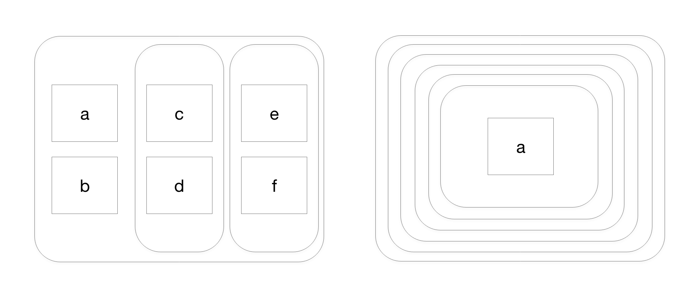

```{r setup, include=FALSE}
knitr::opts_chunk$set(echo = TRUE)
library(tidyverse)
library(modelr)
library(lubridate)
```

---

# Chapter 19

## 19.3.1

### P1

source code:

```{r, eval=FALSE}
f1 <- function(string, prefix) {
  substr(string, 1, nchar(prefix)) == prefix
}
f2 <- function(x) {
  if (length(x) <= 1) return(NULL)
  x[-length(x)]
}
f3 <- function(x, y) {
  rep(y, length.out = length(x))
}
```

- f1: evaluates whether the given string starts with (or equals to) the given prefix string. A better name for the function would be `starts_with`.

- f2: returns a vector created by removing the last element of the given vector. A better name for the function would be `remove_last`.

- f3: returns a vector with n elements, where each element is the given data, y. Here n is the length of given data, x. A better name for the function would be `replace_with`.


## 19.4.4

### P1

```{r}
number <- runif(1, 0, 10000)
```

1. While `if` can handle various conditions, `ifelse` can only handle one condition at once.

```{r}
# if
if (number < 10) {
  print("smaller than 10!")
} else if (number < 100) {
  print("betweeen 10 and 99!")
} else if (number < 1000) {
  print("between 100 and 999!")
} else {
  print("bigger than or equal to 1000!")
}

# ifelse
ifelse(number < 1000, "smaller than 1000!", "bigger than or equal to 1000!")
```

2. There should not be a return value (or execution of some code) for `if`, if the condition is not matched. `ifelse` should return something even if the condition is not matched.

```{r}
# if
if (number == 0) {
  print("Zero!")
}

# ifelse
ifelse(number == 0, "Zero!", "Not zero!")
```

3. While `if` statements can execute some code othen than returning a value, `ifelse` only can return a value.

```{r}
# if
if (number == 0) {
  tibble(x = runif(10), y = runif(10)) %>% 
    ggplot(aes(x, y)) +
    geom_point()
}

# ifelse
ifelse(number == 0, 0, 1)
```


### P6

```{r, eval=FALSE}
switch(x, 
  a = ,
  b = "ab",
  c = ,
  d = "cd"
)
```

`switch` finds the matching value for the given argument, and then returns a corresponding value. For example, in the example above, the function returns "ab" if x is "b", and returns "cd" if x is "d". If there is no matching value, nothing happens. For example, if x is "e", nothing happens. If there is no correseponding value, the function returns the next coming value. For example, if x is "a", it returns "ab".


## 19.5.5

### P4

It indicates the method in which correlation coefficient is computed. The default value is "pearson". (By documentation -- `?cor`)


---

# Chapter 20

## 20.3.5

### P2

```{r}
dplyr::near
```

It evaluates if the difference between given two numbers(`x`, `y`) are smaller than the given tolerance(`tol`). The default value for `tol` is `.Machine$double.eps^0.5`.


## 20.5.4

### P1



- 1. left graph: `list(a, b, list(c, d), list(e, f))`
- 2. right graph: `list(list(list(list(list(list(a))))))`


## 20.7.4

### P2

```{r, eval=FALSE}
tibble(
  x = c(1, 2, 3),
  y = c(1, 2, 3, 4)
)
```

An error occurs. Tibble forces the columns to have same length.

> Error: Tibble columns must have consistent lengths, only values of length one are recycled: * Length 3: Column `x` * Length 4: Column `y`


### P3

```{r}
tibble(
  x = list(1, 2, 3),
  y = c(4, 5, 6)
)
```

It is OK.


---

# Chapter 21

## 21.2.1

### P2

```{r}
str_c(letters, collapse = "")

sd(sample(100))

accumulate(runif(100), sum)
```


## 21.3.5

### P3

```{r}
show_mean <- function(df) {
  for (i in seq_along(df)) {
    if (is.numeric(df[[i]])) {
      colname <- colnames(df)[i]
      mean <- mean(df[[i]])
      
      print(sprintf("#> %-13s %.2f", sprintf("%s:", colname), mean))
    }
  }
}

show_mean(iris)
```


## 21.4.1

### P1

```{r}
(m <- matrix(c(1, 2, 3, 4, 5, 6), nrow = 2))
```

When `margin` argument is 1, it iterates over each row. That is: 

```{r}
m %>% apply(1, mean)

# equivalent
result <- vector("numeric", nrow(m))
for (i in 1:nrow(m)) {
  result[i] <- mean(m[i, ])
}
result
```

When `margin` argument is 2, it iterates over each column. That is:

```{r}
m %>% apply(2, mean)

# equivalent
result <- vector("numeric", ncol(m))
for (i in 1:ncol(m)) {
  result[i] <- mean(m[,i])
}
result
```


## 21.5.3

### P1

```{r}
mtcars %>% 
  map(mean)

nycflights13::flights %>% 
  map(typeof)

iris %>% 
  map(function(col) length(unique(col)))

c(-10, 0, 10, 100) %>% 
  map(rnorm, n = 10)
```


## 21.9.3

### P3

```{r, eval=FALSE}
col_sum3 <- function(df, f) {
  is_num <- sapply(df, is.numeric)
  df_num <- df[, is_num]

  sapply(df_num, f)
}

df <- tibble(
  x = 1:3, 
  y = 3:1,
  z = c("a", "b", "c")
)

# OK
col_sum3(df, mean)

# Has problems: don't always return numeric vector
col_sum3(df[1:2], mean) # OK
col_sum3(df[1], mean) # OK
col_sum3(df[0], mean) # ! error occurs
col_sum3(df[3], mean) # ! returns empty list
```

When an empty data frame is given, an error occurs as the function subsets the data frame with `[]` using list object(`is_num`), which is invalid for an empty data frame.

---

# Chapter 23

## 23.4.5

### P1

```{r}
mod1 <- lm(y ~ x, sim2)
mod2 <- lm(y ~ x - 1, sim2)

mod1$coefficients
mod2$coefficients

# predictions
(grid <- sim2 %>% 
  data_grid(x) %>% 
  gather_predictions(mod1, mod2))
```

The fitted model with intercept:

$$
Y = 1.1522 + 6.9639X_b + 4.9750X_c + 0.7588X_d
$$

The fitted model without intercept:

$$
Y = 1.1522X_a + 8.1160X_b + 6.2172X_c + 1.9110X_d
$$

The regression coefficients of $X_b$, $X_c$, $X_d$ increased by 1.1522, which is the intercept value of the model with intercept, and regressor $X_a$ is added to the model with the value 1.1522.

Actually, the coefficients of the model without intercept are means of responses(`y`) with corresponding regressor(`x`) value, while the coefficients of the model with intercept are differences of means of responses with corresponding regressor value from the mean of responses with `x = "a"`.

Thus the prediction values remain unchanged.


---

# Chapter 24

## 24.2.3

### P2

A percentage change in `carat` would increase the `price` of a diamond by about $a_1$%. 

Note that if x is sufficiently small,

$$
log(1 + x) = log(1) + log(1)'x + ... ≈ x
$$

Thus 1% changes in `x` would increase `y` approximately by $a_1$%: 

$$
log(y + \Delta{y}) - log(y) = a_1(log(x + 0.01x) - log(x))
\\
log(1 + \frac{\Delta{y}}{y}) = a_1log(1 + 0.01) ≈ 0.01a_1
\\
\rightarrow log(1 + \frac{\Delta{y}}{y}) ≈ \frac{\Delta{y}}{y} ≈ 0.01a_1
\\
\rightarrow \Delta{y} ≈ 0.01a_iy = a\%*y
$$

```{r}
mod3 <- lm(log(price) ~ log(carat), diamonds)

mod3$coefficients
```

A percentage change in carat would increase the price by about 1.67%.


## 24.3.5

### P2

```{r}
daily <- nycflights13::flights %>% 
  mutate(
    date = make_date(year, month, day)
  ) %>% 
  group_by(date) %>% 
  summarize(n = n()) %>% 
  mutate(
    wday = wday(date, label = TRUE)
  )
daily

mod4 <- lm(n ~ wday, daily)
daily <- daily %>% 
  add_residuals(mod4)

ggplot(daily, aes(date, resid)) +
  geom_line(aes(color = wday))

term <- function(date) {
  cut(
    date,
    breaks = ymd(20130101, 20130605, 20130825, 20140101),
    labels = c("srping", "summer", "fall")
  )
}

daily <- daily %>% 
  mutate(term = term(date))

daily %>% 
  top_n(3, resid)
```

The three days are weekend days after big holidays in America. That is, "2013-11-30" and "2013-12-01" are respectively saturday, sunday after Thanksgiving day, "2013-11-28". "2013-12-28" is saturday after Christmas, "2013-12-25".

---

# Extra Questions

### 1.

#### a.

As distances between vertically nearest rules on the paper are all 1cm, any point on the paper should have the distance to the vertically nearest line between 0 and 0.5. As the Frances' point is vertically randomly and uniformly distributed, its distance to the nearest horizontal line is randomly and uniformly distributed between 0 and 0.5.


#### b ~ c.

```{r}
random_lines <- function(n, width, height) {
  
  # b & c. Generate centers and angles, which determines lines.
  centers <- tibble(
    id = 1:n,
    x = runif(n, 0, width),
    y = runif(n, 0, height),
    angle = runif(n, 0, 180)
  )
  
  # Calculate left endpoints of each line.
  left_points <- tibble(
    id = 1:n,
    end = "left",
    x = centers$x - 0.25*sinpi(centers$angle),
    y = centers$y + 0.25*cospi(centers$angle)
  )
  
  # Calculate right endpoints of each line.
  right_points <- tibble(
    id = 1:n,
    end = "right",
    x = centers$x + 0.25*sinpi(centers$angle),
    y = centers$y - 0.25*cospi(centers$angle)
  )
  
  # Plot of randomly generated lines.
  plot <- rbind(left_points, right_points) %>% 
    ggplot(aes(x, y)) +
    geom_point() +
    geom_line(aes(group = id))
  
  # Summary of randomly generated lines.
  lines_summary <- centers %>% 
    left_join(
      left_points %>% 
        left_join(
          right_points,
          by = "id",
          suffix = c(".left", ".right")
        ) %>% 
        select(-end.left, -end.right),
      by = "id",
      suffix = c(".center", "")
    )
  
  return(
    list(lines_summary, plot)
  )
}
```

```{r}
lines <- random_lines(1000, 10, 10)
lines[1] # Summary table
lines[2] # Plot
```


#### d.

Two endpoints of each line are calculated above, given center points and angles. A line crosses a horizontal line when integer ceiling of y coordinate value of a endpoint which is bigger than another's and integer floor of y coordinate value of a endpoint which is smaller than another's are same. That is:

$$
floor(max(y.left, y.right)) = ceiling(min(y.left, y.right))
$$

#### e.

```{r}
cal_fraction <- function(n, width, height) {
  
  # Calculate fraction of crossing lines.
  fraction <- random_lines(n, width, height)[[1]] %>% 
    mutate(
      floor = floor(pmax(y.left, y.right)),
      ceiling = ceiling(pmin(y.left, y.right)),
      cross = near(floor, ceiling)
    ) %>% 
    summarize(
      fraction = mean(cross)
    )
  
  return(fraction$fraction)
}

test <- replicate(100, cal_fraction(1000, 100, 100))

mean(test)
hist(test)
```

#### f.

As the length of a line is 0.5, the probability of crossing is $1/\pi ≈ 0.3183$.

Reference: https://mste.illinois.edu/activity/buffon/

### 2.

#### a.

```{r}
is_versicolor <- iris$Species == "versicolor"
(swidth.versicolor <- iris$Sepal.Width[is_versicolor])
```

To check the result,

```{r}
swidth.versicolor.unvectorized <- NULL
for (i in seq_len(nrow(iris)) ) {
  if (iris$Species[i]=="versicolor") {
    swidth.versicolor.unvectorized <- c(
      swidth.versicolor.unvectorized, iris$Sepal.Width[i]
    )
  }
}

identical(swidth.versicolor, swidth.versicolor.unvectorized)
```

#### b.

```{r}
data(iris)
head(iris$Sepal.Length[iris$Species])
```

```{r}
unclass(iris$Species)

iris$Sepal.Length[1] # "setosa"
iris$Sepal.Length[2] # "versicolor"
iris$Sepal.Length[3] # "virginica"
```

`iris$Species` is a class factor, and the corresponding values of "setosa", "versicolor", "virginica" are 1, 2, 3, respectively.

So the value of `iris$Sepal.Length[1]`, 5.1, is presented. That is, the result is equivalent to `iris$Sepal.Length[c(1, 1, 1, 1, 1, 1)]`.

